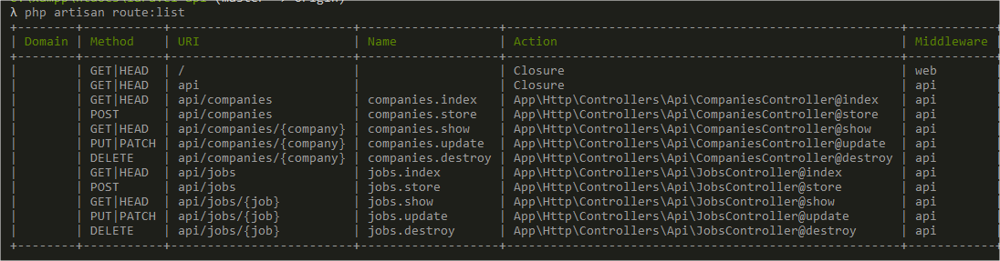
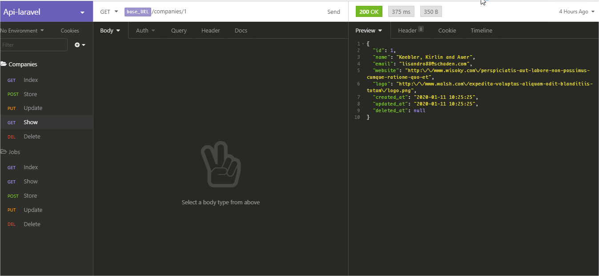

# Laravel-API

Projeto para consumo de API Laravel, simulando empresa/vaga(s) com as tabelas companies e jobs.

### Pré-requisitos

Ambiente local configurado, projeto Laravel iniciado.

## Iniciando

Instruções abaixo:
- Criar o bando de dados e configurar no .env (com nome de exemplo laravel-api);
- Executar as migrations com o comando: ```php artisan migrate```;
- Criar dados fictícios (opcional, utilizado o componente faker), com o comando: ```php artisan db:seed```;
- Rotas: 
  


## Funcionando




## Autor

* **Cristian Kozlowski**


## License

Laravel framework é um software de código aberto licenciado pela [MIT license](https://opensource.org/licenses/MIT).
